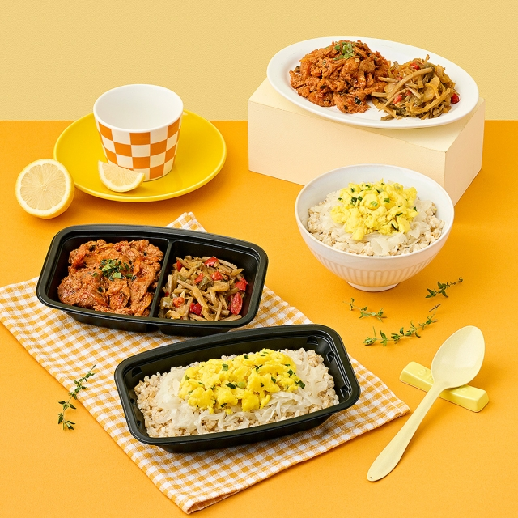

# 🛒 풀무원 쇼핑몰 퍼블리싱

> HTML/CSS/JavaScript와 JSON 데이터를 기반으로 구현한 식품 커머스 퍼블리싱 프로젝트

실제 식품 쇼핑몰의 메인 페이지와 상품 상세 페이지 구조를 분석하고,  
상품 데이터 렌더링 · 반응형 레이아웃 · 슬라이더 · 검색 · 탭 · 토스트 피드백까지 구현했습니다.

[](https://ebj0925-cyber.github.io/0311_2/)

---

## 📌 목차

- 🚩 [개요](#-개요)
- 🔧 [기술 스택](#-기술-스택)
- ✨ [핵심 기능](#-핵심-기능)
- 💡 [코드와 구현 포인트](#-코드와-구현-포인트)
- 🖼️ [주요 화면](#%EF%B8%8F-주요-화면)
- 📁 [폴더 구조](#-폴더-구조)
- ▶️ [로컬 실행](#%EF%B8%8F-로컬-실행)
- 📎 [Portfolio](#-portfolio)
- 🔗 [링크](#-링크)

---

## 🚩 개요

| 항목 | 내용 |
|---|---|
| **프로젝트명** | 풀무원 쇼핑몰 퍼블리싱 |
| **유형** | 1인 개인 퍼블리싱 프로젝트 |
| **개발 기간** | 2025.03 |
| **목표** | 실제 커머스 사이트 구조를 분석하고, JSON 기반 동적 상품 UI와 반응형 쇼핑몰 화면 구현 |
| **역할** | 화면 구조 분석 · HTML/CSS 퍼블리싱 · JavaScript 렌더링 · 인터랙션 보강 · GitHub Pages 배포 |

### 프로젝트 방향

단순한 정적 클론에서 끝내지 않고, 사용자가 실제로 눌러볼 수 있는 커머스 UI에 가깝게 보강했습니다.

- 상품 데이터와 화면 구조를 분리해 JSON 기반으로 카드 UI를 렌더링
- 메인 슬라이더, 추천 상품, 브랜드 상품, 상세 페이지를 각각 독립적인 구조로 구현
- 검색, 탭 전환, 찜/장바구니, 헤더 버튼, 구매 버튼에 토스트 피드백 추가
- GitHub Pages에서 바로 확인 가능한 정적 웹 프로젝트로 배포

---

## 🔧 기술 스택

| 구분 | 기술 | 역할 |
|---|---|---|
| **Markup** | HTML5 | 메인/상세 페이지 구조 설계 |
| **Style** | CSS3 | 공통 레이아웃, 상품 카드, 반응형 UI 구현 |
| **Language** | JavaScript | JSON 렌더링, DOM 조작, 이벤트 처리 |
| **Data** | Local JSON | 섹션별 상품 데이터 분리 |
| **Deploy** | GitHub Pages | 정적 웹 페이지 배포 |
| **Tool** | VS Code, Git/GitHub | 개발 및 버전 관리 |

---

## ✨ 핵심 기능

### 1. 메인 슬라이더 배너

- `slider.json` 데이터를 기반으로 슬라이드 UI 생성
- 화면 너비에 따라 1개, 2개, 3개씩 보이도록 반응형 처리
- 이전/다음 버튼, 자동재생, 재생/정지 버튼 구현

### 2. JSON 기반 상품 카드 렌더링

- 추천, 세일, 야식, 재구매, ORGA, 반듯한식, 신상품, 브랜드 섹션을 JSON 데이터로 분리
- `fetch API`와 `forEach`를 사용해 상품 카드 반복 렌더링
- 상품명, 브랜드, 가격, 할인율, 리뷰 수, 태그를 데이터 기반으로 출력

### 3. 검색 · 탭 · 헤더 피드백

- 검색어 입력 후 상품 카드 텍스트와 매칭
- 검색 결과 첫 카드로 스크롤 이동 및 강조 표시
- `#PLUS 장보기` 탭 클릭 시 active 상태 전환
- 로그인, 회원가입, 장바구니, 카테고리 버튼에 시연용 토스트 피드백 제공

### 4. 상품 섹션 캐러셀

- 섹션별 이전/다음 버튼 클릭 시 상품 카드가 한 칸씩 순환
- 공통 함수로 여러 상품 섹션의 이동 로직을 재사용
- 동적으로 생성된 상품 카드에도 동일한 인터랙션 적용

### 5. 상품 상세 페이지

- `sub.json` 데이터를 기반으로 상품명, 가격, 원산지, 배송 정보, 추천 상품 렌더링
- 썸네일 클릭 시 대표 이미지 변경
- 상세 정보, 구매 정보, 리뷰, 문의, 배송/환불 탭 구성

### 6. 수량 변경 & 총액 계산

- `+ / -` 버튼으로 수량 변경
- 수량이 1 미만으로 내려가지 않도록 조건 처리
- 단가 × 수량 계산 후 총 상품금액에 즉시 반영

---

## 💡 코드와 구현 포인트

### Decision 01. 상품 데이터와 HTML 구조 분리

상품 정보를 HTML에 직접 작성하지 않고 JSON 파일로 분리했습니다.  
데이터 수정 시 JSON만 변경하면 화면에 반영되도록 구성해 유지보수성을 높였습니다.

```js
fetch("./json/01_recommend.json")
  .then((response) => response.json())
  .then((data) => {
    const list = document.querySelector(".recommend_list");
    let html = "";

    data.forEach((item) => {
      html += `
        <li class="product_item">
          <a href="./sub.html">
            <div class="product_img">
              
            </div>
          </a>
        </li>
      `;
    });

    list.innerHTML = html;
  });
```

### Decision 02. 반응형 메인 슬라이더

화면 너비에 따라 슬라이드 표시 개수를 다르게 계산했습니다.  
모바일, 태블릿, 데스크톱에서 같은 슬라이더 구조를 유지하면서도 화면 밀도를 조정할 수 있습니다.

```js
function getVisibleCount() {
  if (window.innerWidth <= 768) return 1;
  if (window.innerWidth <= 1024) return 2;
  return 3;
}
```

### Decision 03. 상품 상세 수량 · 총액 계산

상세 페이지에서는 수량 변경에 따라 총액이 즉시 바뀌도록 했습니다.  
최솟값을 1로 제한해 실제 구매 UI와 비슷한 흐름을 구성했습니다.

```js
function updateTotal() {
  totalPrice.textContent = formatPrice(unitPrice * quantity);
}

minusBtn.addEventListener("click", () => {
  if (quantity > 1) {
    quantity -= 1;
    countInput.value = quantity;
    updateTotal();
  }
});
```

### Decision 04. 공통 인터랙션 모듈 분리

상품 이동, 찜/장바구니, 검색, 탭, 헤더 피드백을 `product_interactions.js`로 분리했습니다.  
동적으로 렌더링되는 상품 카드에도 같은 이벤트가 적용되도록 공통 처리했습니다.

```js
function setupSectionControls() {
  const sectionButtons = document.querySelectorAll(".section_btn button");

  sectionButtons.forEach((button) => {
    button.addEventListener("click", () => {
      const section = button.closest(".section, .orga, .brand_section");
      const track = section?.querySelector(".product_list, .product_grid_3");

      if (!track) return;
      moveProductTrack(track, button.classList.contains("prev") ? -1 : 1);
    });
  });
}
```

### Decision 05. 사용자 피드백 토스트

클릭해도 아무 반응이 없는 UI는 미완성처럼 보일 수 있어,  
검색, 찜, 장바구니, 로그인, 구매 버튼에 토스트 메시지를 추가했습니다.

```js
function showProductToast(message) {
  let toast = document.querySelector(".product_toast");

  if (!toast) {
    toast = document.createElement("div");
    toast.className = "product_toast";
    toast.setAttribute("role", "status");
    toast.setAttribute("aria-live", "polite");
    document.body.appendChild(toast);
  }

  toast.textContent = message;
  toast.classList.add("is_show");
}
```

---

## 🖼️ 주요 화면

<table>
  <tr>
    <td width="50%" align="center">
      
      <br />
      <strong>메인 슬라이드</strong>
      <br />
      <sub>JSON 데이터 기반으로 구성한 메인 히어로 슬라이더입니다.</sub>
    </td>
    <td width="50%" align="center">
      
      <br />
      <strong>프로모션 배너</strong>
      <br />
      <sub>상품 섹션 사이에 배치된 커머스형 프로모션 영역입니다.</sub>
    </td>
  </tr>
  <tr>
    <td width="50%" align="center">
      
      <br />
      <strong>브랜드 섹션</strong>
      <br />
      <sub>대표 브랜드 배너와 상품 카드 그리드를 함께 구성했습니다.</sub>
    </td>
    <td width="50%" align="center">
      
      <br />
      <strong>상품 상세</strong>
      <br />
      <sub>상품 이미지, 가격, 옵션, 수량 선택 UI를 렌더링합니다.</sub>
    </td>
  </tr>
</table>

---

## 📁 폴더 구조

```text
0311_2/
├── index.html                  # 메인 쇼핑몰 페이지
├── sub.html                    # 상품 상세 페이지
├── README.md
│
├── css/
│   ├── reset.css               # 기본 스타일 초기화
│   ├── common.css              # 헤더, 푸터, 공통 UI
│   ├── layout.css              # 공통 레이아웃, 반응형 보정
│   ├── main.css                # 메인 페이지 스타일
│   └── sub.css                 # 상세 페이지 스타일
│
├── js/
│   ├── slider.js               # 메인 슬라이더
│   ├── quick_menu.js           # 퀵메뉴 렌더링
│   ├── 01_fetch_*.js           # 섹션별 상품 렌더링
│   ├── 08_fetch_brand.js       # 브랜드 섹션 렌더링
│   ├── sub.js                  # 상세 페이지, 수량 계산, 탭
│   └── product_interactions.js # 검색, 상품 이동, 찜/장바구니 피드백
│
├── json/
│   ├── slider.json             # 슬라이더 데이터
│   ├── quick_menu.json         # 퀵메뉴 데이터
│   ├── 01_*.json ~ 08_*.json   # 섹션별 상품 데이터
│   └── sub.json                # 상세 페이지 데이터
│
├── img/
│   ├── slider/                 # 메인 슬라이더 이미지
│   ├── banner/                 # 배너, 퀵메뉴 이미지
│   ├── icon/                   # UI 아이콘
│   ├── 01_recommend/ ~ 08_brand/ # 섹션별 상품 이미지
│   └── sub/                    # 상세 페이지 이미지
│
└── portfolio/                  # PPT/PDF 및 미리보기 이미지
```

---

## ▶️ 로컬 실행

이 프로젝트는 별도 빌드 도구 없이 실행하는 정적 HTML/CSS/JavaScript 프로젝트입니다.  
JSON 파일을 `fetch()`로 불러오기 때문에 파일을 직접 더블클릭하기보다 VS Code Live Server로 확인하는 것을 권장합니다.

```text
1. VS Code에서 프로젝트 폴더 열기
2. index.html 우클릭
3. Open with Live Server 선택
```

---

## 📎 Portfolio

- [PPT 다운로드](./portfolio/풀무원쇼핑몰_포트폴리오_v7.pptx)

---

## 🔗 링크

| 구분 | 링크 |
|---|---|
| **Live Demo** | https://ebj0925-cyber.github.io/0311_2/ |
| **Main Page** | https://ebj0925-cyber.github.io/0311_2/index.html |
| **Sub Page** | https://ebj0925-cyber.github.io/0311_2/sub.html |
| **Repository** | https://github.com/ebj0925-cyber/0311_2 |

---

<p align="right">
  <sub>풀무원 쇼핑몰 퍼블리싱 · YOMNIVERSE · 조은정</sub>
</p>
